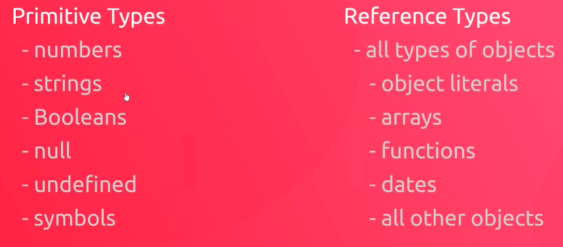
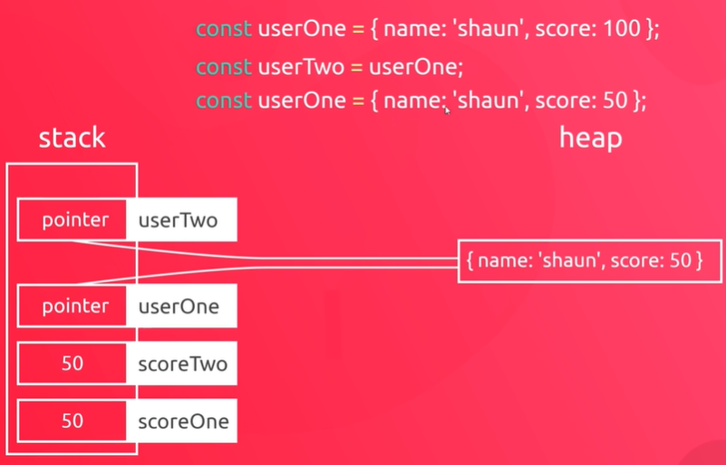

## var, let, const
- **var**: function scope
   - **hoisting**: let variable available to a broader scope beyond where it's declared
- **let**: block scope
  - the varaible will only be available within the block where it's declared

## this keyword
- a context object, which represents the context in which the current code is executed

## forEach
- a method for array
- register a call back function
- blog is the parameter for the call back function
```javaScript
  this.blogs.forEach(blog => {console.log(blog);})
```
## arrow function & this
- when we use arrow function, this still refers to the global window object
- so, to use this inside a method to refer to the actual object, we need to use a regular function

```javaScript
let user = {
  name: 'crystal',
  age: 30,
  email: 'benjiim@gmai.com',
  location: 'china',
  blogs: ['topic1', 'topic2'],
  login: function(){
    console.log('user logged in');
  },
  logout: function() {
    console.log('the user logged out');
  },
  logBlogs: ()=> {
    console.log(this);
  }
};
user.logBlogs();
console.log(this);

```

## array of object inside a object
```javaScript
let user = {
  name: 'crystal',
  age: 30,
  email: 'benjiim@gmai.com',
  location: 'china',
  blogs: [
  { title: 'topic1', likes: 30 },
  { title: 'tipic2', likes:100 }
  ],
  login(){
    console.log('user logged in');
  },
  logout() {
    console.log('the user logged out');
  },
  logBlogs(){
    this.blogs.forEach(blog => {
      console.log(blog.title, blog.likes);
    })
  }
};
user.logBlogs();
```

## javaScript built-in object

```javaScript
console.log(Math);
console.log(Math.PI);
console.log(Math.E);

const area = 5.9;

console.log(Math.round(area));
console.log(Math.floor(area));
console.log(Math.ceil(area));
console.log(Math.trunc(area));

// random numbers
const random = Math.random();
console.log(random);
console.log(Math.round(random * 100));
```

## Primitive Types and Reference Types
- primitive types: stored on stack
- reference types: stored on heap




- when we make copies of primitive values, we make a new copy of the value on the stack

- when we try to make a copy of a reference type, we only make a copy of the pointer on the stack




```javaScript
// primitive types example
let scoreOne = 50;
let scoreTwo = scoreOne;
console.log(`scoreOne: ${scoreOne}`, `scoreTwo: ${scoreTwo}`);
scoreOne = 100;
console.log(`scoreOne: ${scoreOne}`, `scoreTwo: ${scoreTwo}`);
```

```javaScript
// reference types example
const user1 = {name: 'ryn', age: 30};
const user2 = user1;
console.log(user1, user2);
user1.age = 100;
console.log(user1, user2);
```


```javaScript
```
```javaScript
```
