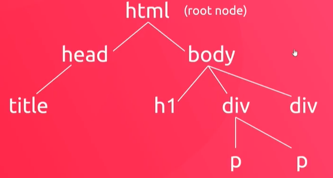
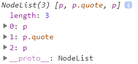
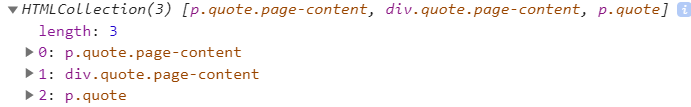

## Document Object Model
- created by the browser when an HTML document loads inside

- 'document' object

- describe html as a hierarchical tree of nodes



#### document.querySelector

```javaScript
// use querySelector to select a single element
const header = document.querySelector('h1');
console.log(header);
const para = document.querySelector('p');
console.log(para);
console.log(document.querySelector('.quote'));
console.log(document.querySelector('div.quote'));
```
#### document.querySelectorAll

```javaScript
// use querySelector to select multiple elements
// nodeList: a group of elements
const paras = document.querySelectorAll('p');
console.log(paras);
// use for each loop
paras.forEach(p=>{
  console.log(p.textContent);
});
// use for loop
for(var i=0; i < paras.length; i++){
  console.log(paras[i]);
}

const quotes = document.querySelectorAll('.quote');
quotes.forEach(quote => {
  console.log(quote);
});


```


- id is unique, you shouldn't have the same id for multiple elements

#### document.getElementById
```javaScript
const title = document.getElementById('page-title');
console.log(title);

```

#### document.getElementsByClassName
```javaScript
const quotes = document.getElementsByClassName('quote');
console.log(quotes);
// you're going to get a HTMLCollection
// you can't use forEach method for HTMLCollection
// but you can still access element using bracket notation
for(var i=0; i<quotes.length; i++){
  console.log(quotes[i]);
}
```



#### document.getElementsByClassName

```javaScript
const paras = document.getElementsByTagName('p');
for(var i=0; i<paras.length; i++){
  console.log(paras[i]);
}
```

#### innerText property
- *textContent* will get all the text value of element
- *innerText* has certain constraints, which only show the visible text

```HTML
    <p>lorem <span style="display: none">error</span> ipsum</p>
    the innerText will not have error value
```

```javaScript
const para = document.querySelector('p');
console.log(para.innerText);

para.innerText = "Opportunity usually shows up in overalls and looking like work." ;
// for appending text, you can use +=
console.log(para.innerText);
```

#### innerHTML property
```javaScript
const content = document.querySelector('.page-content');
const people = ['tizzy', 'eva', 'isak', 'yusef'];
// a database scenario
people.forEach(p=>{
  content.innerHTML += `<li>${p}</li>`;
});

```
## Get/ Set html element attribute
Be cautious when using setAttribute, because it will overwrite the previous value completely

```javaScript
const link = document.querySelector('a');
console.log(link.getAttribute('href'));

link.setAttribute('href','https://www.baidu.com');
link.setAttribute('style', 'background: yellow');
// add style attribute automatically
link.innerText = 'Baidu Page';
```

#### style attribute

```javaScript
const title = document.querySelector('h1');
console.log(title.style);
title.style.margin = '50px';
title.style.color = 'crimson';
title.style.fontSize = '2rem';
title.style.margin ='';
```
#### classList attribute
```javaScript
const content = document.querySelector('.error');
console.log(content.classList);
content.classList.add("success");
content.classList.remove('error');
console.log(content.classList);
```
- classList.toggle('class-name') will append defined class if not exist, or remove it if exist

```javaScript
  const title = document.querySelector('.page-title');
  title.classList.toggle('test');
```

## Parent, Children and Sibling

#### children

-  **Array.from()** used to convert HTMLCollection to an array
```javaScript
const article = document.querySelector('article');

Array.from(article.children).forEach(child => {
  child.classList.add('article-element');
});
console.log(article.children);

```
#### parentElement
```javaScript
const title = document.querySelector('h2');
console.log(title);
console.log(title.parentElement);

```
#### sibling
```javaScript
const title = document.querySelector('h2');
console.log(title.nextElementSibling);
console.log(title.previousElementSibling);

console.log(title.nextElementSibling.parentElement.children);

```
