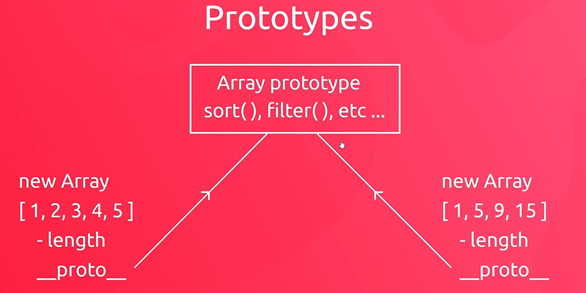

## OOP

- array is just a type of object in js
- array has length property and methods

```javaScript
// create array direcly
const names = ['tizzy', 'eva'];
// create array using Array constructor
const ages = new Array(18, 20, 25);
```

```javaScript
// create object
const userOne = {};
// create object using Object constructor
const userTwo = new Object();
```

- everything in js is object except for primitive types

- when we use properties/ methods of a primitive type, js takes that primitive value and wraps it temporarily in a wrapper object

- so, although not everything in js is an object, everything in js can behave like an object.


## Class

- a Class is like a blueprint for an object, whcih describes the general properties and methods of an object

- instance: the individual object that we actually create using the class

- arrow function don't bind to 'this' keyword

#### What the 'new' keyword does?
1. It creates a new empty object{}
2. It binds the value of 'this' to the new empty object
3. It calls the constructor function to 'build' the object

## Method Chaining
- using the return value to chain methods together

```javaScript
class User{
  constructor(username, email){
    this.username = username;
    this.email = email;
    this.score = 0;
  }
  login(){
    console.log(`user ${this.username} logging in`);
    return this;
  }
  logout(){
    console.log(`user ${this.username} logging out`);
    return this;
  }
  incScore(){
    this.score ++;
    console.log(`user ${this.username} has a score of ${this.score}`);
    return this;
  }
}

const userOne = new User('tizzy','123@qq.com');
userOne.login().incScore().incScore().incScore().logout();
```

## Constructor
- class keyword: just a thin layer of abstraction over the prototype model
- we can use constructor function to create new objetcs without using a class
- lives underneath the abstraction of class

```javaScript
function User(username, email){
  this.username = username;
  this.email = email;
  this.login = function(){
    console.log(`user ${this.username} logging in`);
    return this;
  };
}
const userOne = new User('tizzy','123@qq.com');
console.log(userOne);
```
## Prototypes
- '\__proto__\' property
- the proto property points to the prototype model of the object
- every object in js has a prototype
- prototypes contain all methods for that object type

- 


```javaScript
// attach methods to user prototype
function User(username, email){
  this.username = username;
  this.email = email;
}

User.prototype.login = function(){
  console.log(`user ${this.username} logging in`);
  return this;
}
const userOne = new User('tizzy','123@qq.com');
console.log(userOne.login());
```

```javaScript

```
